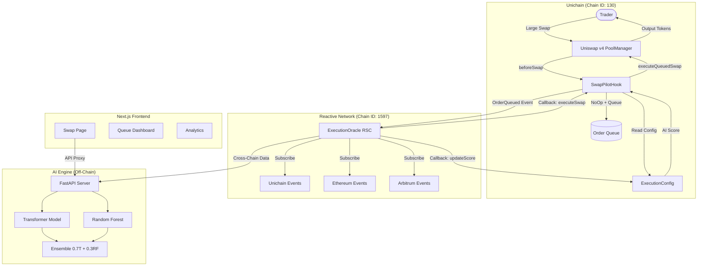

# SwapPilot — Architecture

## System Overview

SwapPilot is an AI-powered Uniswap v4 Hook that intercepts large swaps via the NoOp pattern, queues them on-chain, and uses Reactive Network RSCs plus an AI engine to execute at the optimal moment — minimizing slippage, price impact, and MEV exposure.



## Component Descriptions

### SwapPilotHook (Uniswap v4 Hook)

The core smart contract deployed on Unichain. Implements `beforeSwap` with the NoOp pattern (`beforeSwapReturnDelta`) to intercept large swaps and queue them for later execution.

- **beforeSwap**: Checks swap amount against pool threshold. Small swaps pass through; large swaps are NoOp'd with input tokens held by the hook.
- **afterSwap**: Emits `SwapExecuted` events for RSC monitoring.
- **executeQueuedSwap**: Called by the Reactive Network Callback Proxy when the AI determines optimal conditions.
- **expireOrder**: Fallback that returns tokens to the trader after `MAX_QUEUE_TIME`.

### ExecutionConfig (On-Chain Config)

Stores per-pool configuration and AI execution scores on Unichain.

- Pool thresholds, max queue times, max slippage tolerances
- AI execution scores (0–100) updated by RSC callbacks
- Score staleness checks (scores older than 2 minutes are ignored)

### ExecutionOracle RSC (Reactive Smart Contract)

Deployed on Reactive Network. Subscribes to events across 3 chains:

| Chain | Events | Purpose |
|---|---|---|
| Unichain (130) | Swap, Mint, OrderQueued | Local pool state |
| Ethereum (1) | Swap | Cross-chain price reference |
| Arbitrum (42161) | Swap | Cross-chain price reference |

Computes a cross-chain execution score and emits `Callback` events that the Reactive Network relays to Unichain.

### AI Engine (Python)

FastAPI inference server running a Transformer + Random Forest ensemble:

- **Input**: 60-step time series of 10 cross-chain features
- **Output**: Execution score (0–100), action (execute/wait/expire), confidence
- **Ensemble**: 70% Transformer + 30% Random Forest
- **Threshold**: Score ≥ 70 → execute; 40–69 → wait; < 40 → expire

### Frontend (Next.js)

Next.js App Router application providing:

- Swap interface with queue threshold warnings
- Real-time order queue dashboard
- AI score gauge and analytics charts
- API routes proxying to the AI engine

## Data Flow

```
1. Trader submits large swap on Unichain
2. PoolManager calls SwapPilotHook.beforeSwap()
3. Hook NoOps the swap, queues the order, emits OrderQueued
4. Reactive Network detects OrderQueued event
5. ExecutionOracle RSC begins intensive cross-chain monitoring
6. RSC aggregates Swap/Mint events from 3 chains
7. RSC feeds metrics to AI engine (or computes on-chain score)
8. AI returns execution score
9. If score > threshold → RSC emits Callback(executeQueuedSwap)
10. Reactive Network Callback Proxy calls SwapPilotHook on Unichain
11. Hook executes the queued swap through PoolManager
12. Output tokens transferred to trader
13. OrderExecuted event emitted
```

## Security Considerations

- **No Stuck Funds**: MAX_QUEUE_TIME (30 minutes) ensures every order resolves. After expiry, anyone can call `expireOrder` to return tokens.
- **Callback Authentication**: Only the Reactive Network Callback Proxy (`0x9299...7FC4`) can call `executeQueuedSwap` and `updateExecutionScore`.
- **Slippage Protection**: Trader-specified `maxSlippage` is checked at execution time.
- **Score Staleness**: Scores older than 2 minutes are ignored by `shouldExecute`.
- **Small Swap Pass-Through**: Swaps below the threshold execute instantly with zero hook interference.
- **No Admin Token Access**: The hook's owner cannot seize queued tokens.
- **Reentrancy Guards**: State mutations follow checks-effects-interactions pattern.
